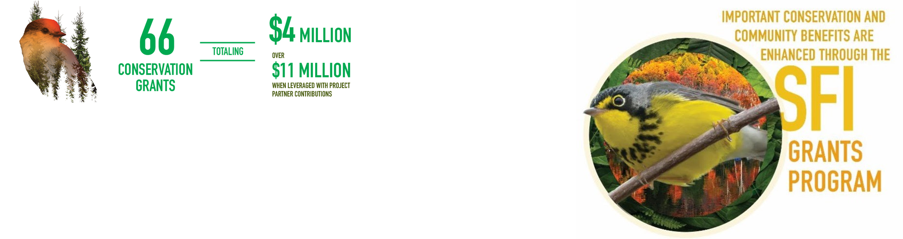
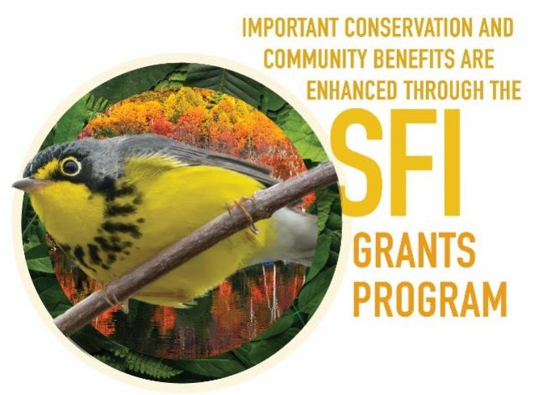

```{r, echo = FALSE, out.width = '90%', fig.align='right'}

```

# [SFI Conservation Grants Program](https://forests.org/conservationgrants/)

### Research to inform sustainable forest mangement

---
class: left 

# BAM's Conservation Grant Goals

1. Develop robust measures of conservation value 

2. Foster collaborative partnerships 

3. Expand our avian modeling tools 

```{r, echo = FALSE, out.width = '20%', fig.align='bottom', fig.align='center'}

```

---
class: center 

# Defining Conservation Value 
 
**Representation:**  
[BEACONS method](https://prvernier.shinyapps.io/consvalue/) 

**Diversity Contribution:**  
[Contribution to regional species richness](https://doi.org/10.1016/j.baae.2006.06.004) 

**Conservation Scores:**  
Sum [PIF Avian Conservation Assessment scores](https://pif.birdconservancy.org/avian-conservation-assessment-database/) 

---

